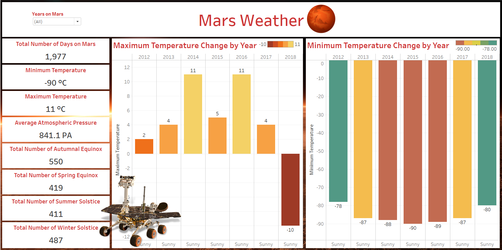

# Mars Weather Analysis


Analyzing the changes in weather on Mars.

## Tech Stack


## Download

```bash
  git clone https://github.com/adionmission/Mars-Weather-Analysis.git
```

## About

The original procedures uses python and jupyter for analysis which did gave a detailed analysis and the jupyter notebook never provieded any dashboard for clean analysis.

As the dataset is not that big, so for data insights, EXCEL was used instead of SQL. But cleaning data in the excel is not reliable at all and even more time consuming than SQL.

Too much of manual work you know 😏.

Now here comes the role on R where you just need to define a function in a pipline.

## Data Pipeline in R

```r
  data_clean = df %>%
    drop_na()
```

## About Dataset

The dataset is about the weather conditions on Mars which was collected by curosity rover.
This data was measured and transmitted via the Rover Environmental Monitoring Station (REMS) on-board the Curiosity Rover. The data was made publicly available by NASA’s Mars Science Laboratory and the Centro de Astrobiología (CSIC-INTA).
The data description given by the acknowledgement is a bit wrong. Wrong about the data type. So, below I have written the correct one. 

The dataset contains the following data:

| Parameter             | Description                                                        | Data Type                                                         |
| ----------------- | ------------------------------------------------------------------ |------------------------------------------------------------------ |
| id | The identification number of a single transmission | Numeric |
| terrestrial_date | The date on Earth (formatted as month/day/year or m/dd/yy). | Character |
| sol | 	The number of elapsed sols (Martian days) since Curiosity landed on Mars. | Character |
| ls | ls = 0: autumnal equinox, ls = 90 : winter solstice, ls = 180 : spring equinox, ls = 270 : summer solstice | Numeric |
| month | The Martian Month. Similarly to Earth, Martian time can be divided into 12 months. | Character |
| min_temp | The minimum temperature (in °C) observed during a single Martian sol. | Character |
| max_temp | 	The maximum temperature (in °C) observed during a single Martian sol. | Character |
| pressure | 	The atmospheric pressure (Pa) in Curiosity's location on Mars. | Character |
| wind_speed | The average wind speed (m/s) measured in a single sol. Note: Wind Speed data has not be transmitted to Earth since Sol 1485. Missing values are coded as NaN. | Character |
| atmo_opacity | Description of the overall weather conditions on Mars for a given sol based on atmospheric opacity | Character |


## Original Methodology
 - Data insights using Python.
 - Data cleaning using Python.
 - Data visualization using Python.

## My Methodology
 - Data insights using Excel.
 - Data cleaning using R programming.
 - Data visualization using Tableau.

## Data Cleaning

Originally, some columns in the dataset which should be date and numeric where in character data type. So first converted those columns.

```r
  data_clean$terrestrial_date = as.Date(data_clean$terrestrial_date)
  data_clean$min_temp = as.numeric(data_clean$min_temp)
```

Then, removed unnecessary columns and removed reamining NAs.

```r
  data_clean = subset(data_clean, select = -c(month, wind_speed))
  data_clean = na.omit(data_clean)
```

Made the ls from numeric to string so as to get count of equinox and solstice.

```r
  data_clean$ls[data_clean$ls %in% data_clean$ls[0:550]] = "autumnal equinox"
  data_clean$ls[data_clean$ls %in% data_clean$ls[551:1037]] = "winter solstice"
```

## New Parameters

Created 4 new parameters to get the count and will be helpful in graphical analysis, which are:

 - Autumnal Equinox
 - Winter Solstice
 - Spring Equinox
 - Summer Solstice

```r
  data_clean$autumnal_equinox[data_clean$autumnal_equinox == "autumnal equinox"] = 1
  data_clean$winter_solstice[data_clean$winter_solstice == "winter solstice"] = 1
  data_clean$spring_equinox[data_clean$spring_equinox == "spring equinox"] = 1
  data_clean$summer_solstice[data_clean$summer_solstice == "summer solstice"] = 1
```

## Visualizations

The visualization were made using Tableau.



## Acknowledgements

 - [Dataset](https://data.world/the-pudding/mars-weather)
